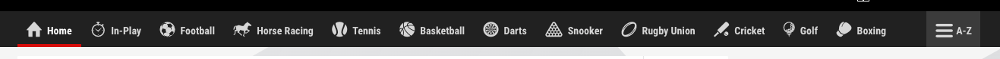

# CMS Tech Task

Below is an example of the type of tickets we work with on a day-to-day basis.   
Admittedly we would probably break this ticket down into smaller chunks, but for the sake of this exercise there are a few different requirements to cover different areas of your technical knowledge.

Please time-box this exercise to no more than a few hours.   
If there are Acceptance Criteria left after that time then have a think about + document how you would address them going forwards.

----

# The Ticket

### Context

Your mission (if you choose to accept it) is to try and build a very simple version of the Content Management Service api.

The Content Management Service is a tool internal staff use to create ordered lists of sports/competitions/events/markets etc which are shown on site.  
For example, the site may have a list of "popular sports", and during a weekend of football we may want that to be top of the list, and other sports lower down.  



Because from our point of view we don't differentiate between sports/competitions/events/markets/etc, we collectively refer to them as "nodes".

You will need to integrate with an external API to source the current available Sports for this ticket.

### High Level Requirements

**As a** member of the content management team  
**I want** an API that allows me to see all Sports that are available in the Sports Book  
**So that** I can use them to create an ordered list of the most popular Sports

**As a** member of the content management team  
**I want** an API that allows me to create ordered lists of sports  
**So that** I can provide front end teams with an ordered list of the most popular sports

**As a** member of the front end web team  
**I want** an API that exposes an ordered list of Sports by its list ID  
**So that** I can show customers the most relevant Sports to them at any moment of time

### Acceptance Criteria

##### Scenario: A user should be able to query all Sports in the Sports Book

**Given** the Sports Book API is running  
**Given** the CMS API is running  
**When** I GET /nodes?type=SPORT  
**Then** I get a response code 200 (OK)  
**Then** I get a response body containing
```json
[
  {
   "id": "the sports book id of the sport",
   "name": "the name of the sport",
   "type": "SPORT"
  }
]
```

##### Scenario: A user should be able to create an ordered list of Nodes

**Given** the Sports Book API is running  
**Given** the CMS API is running  
**Given** a Sport exists in the Sports Book with id S1  
**Given** a Sport exists in the Sports Book with id S2  
**When** I `POST /list` with payload
```json
{
 "name": "the list name",
 "nodes": [
  {
   "id": "S1",
   "type": "SPORT",
   "position": 0
   },
   {
   "id": "S2",
   "type": "SPORT",
   "position": 1
   }
 ]
}
```
**Then** I get a response code 200 (OK)  
**Then** I get a response body containing  
```json
{
 "id": "the list id", // e.g a UUID or some other unique string
 "name": "the list name",
 "nodes": [
  {
   "id": "S1",
   "type": "SPORT",
   "position": 0
  },
  {
   "id": "S2",
   "type": "SPORT",
   "position": 1
  }
 ]
}
```

##### Scenario: A user should be able to retrieve an ordered list of Nodes

**Given** the Sports Book API is running  
**Given** the CMS API is running  
**Given** a Sport exists in the Sports Book with id S1  
**Given** a Sport exists in the Sports Book with id S2  
**Given** Sports S1 and S2 have been added to a list  
**When** I `GET /list/{list-id}`  
**Then** I get a response code 200 (OK)  
**Then** I get a response body containing
```json
{
 "id": "the list id",
 "name": "the list name",
 "nodes": [
  {
   "id": "S1",
   "type": "SPORT",
   "position": 0
  },
  {
   "id": "S2",
   "type": "SPORT",
   "position": 1
  }
 ]
}
```

### Tech Elab

So that this application fits in with the rest of our tech stack, we need it to be:
- A Spring Boot App
- Written in Java or Kotlin (whichever you feel most comfortable with)
- Built using Maven or Gradle
- Runnable via Docker/Docker Compose

For the First Acceptance Criteria you will need to integrate with an external API called "The Sports book API" which exposes all the sports/competitions that are active at the moment.
There is a Docker Compose file in this repository which runs the Sports Book API on `http://localhost:9001`.  
The API has Swagger Docs if you wish to look around, and contains one POST endpoint which accepts a json payload in the form:
```json
{
  "locale": "en_GB",
  "attachments": ["SPORT"], // An array of the types you want to be returned in the response e.g. SPORT, COMPETITION
  "filters": { // Optional
    "sportIds": ["a sport id"] // Optional
  }
}
```
Note that the API only returns Sports/Competitions that are currently active, so the elements in your response payload may be subtly different for each request.

For the second Acceptance Criteria you will need a way of persisting lists of Nodes.   
In the team we use a MySQL database for this purpose, but feel free to use any other database type e.g. Mongo.  
Ensure this database is set up to run in the docker compose file along with the Sports Book API.

### Test Elab

Ensure all code is well unit tested

Ensure there is sufficient end-to-end/component tests to give confidence the Acceptance Criteria are met
